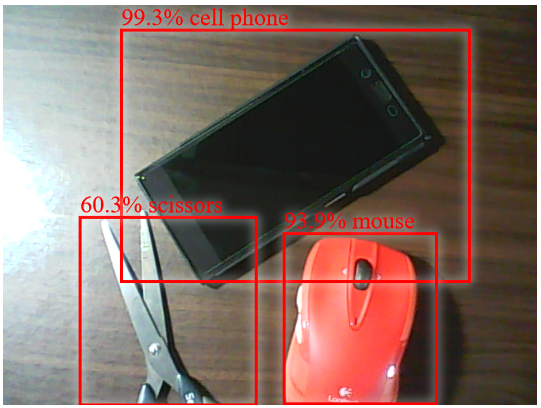

# tfjs-coco-ssd-vue-example
A tensorflow.js coco-ssd example made with Vue.js. Ready your webcam and have fun.

## Live demo (on CodeSandBox)
[https://4zrnz12744.codesandbox.io/](https://4zrnz12744.codesandbox.io/)

## Demo screenshot


## Project setup
```
npm install
```

### Compiles and hot-reloads for development
```
npm run serve
```

### Compiles and minifies for production
```
npm run build
```

### App url (in local dev server)
[http://localhost:8080/](http://localhost:8080/)

## References
- [tfjs-models/coco-ssd](https://github.com/tensorflow/tfjs-models/tree/master/coco-ssd)
- [TensorFlow.js — Real-Time Object Detection in 10 Lines of Code](https://hackernoon.com/tensorflow-js-real-time-object-detection-in-10-lines-of-code-baf15dfb95b2)
